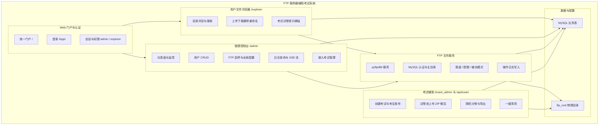
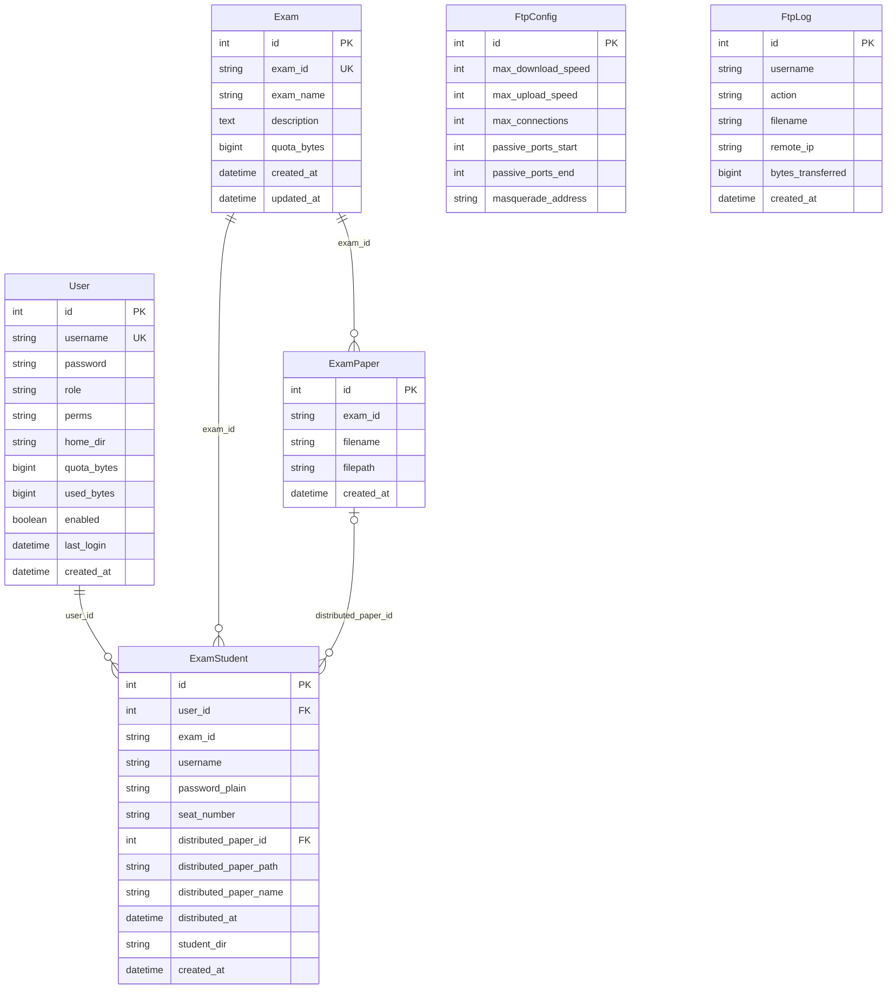
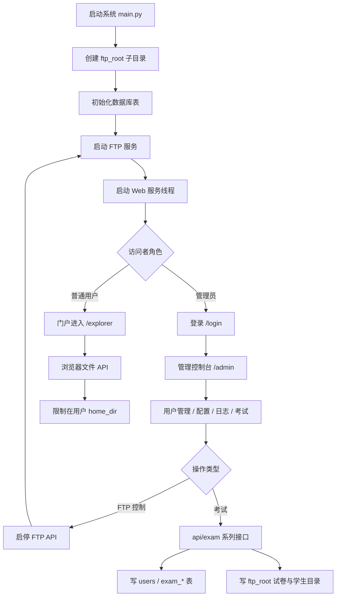
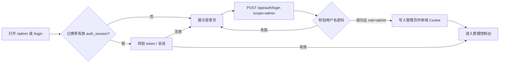
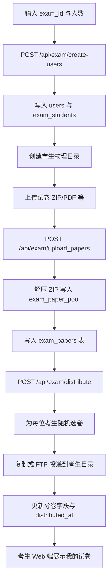
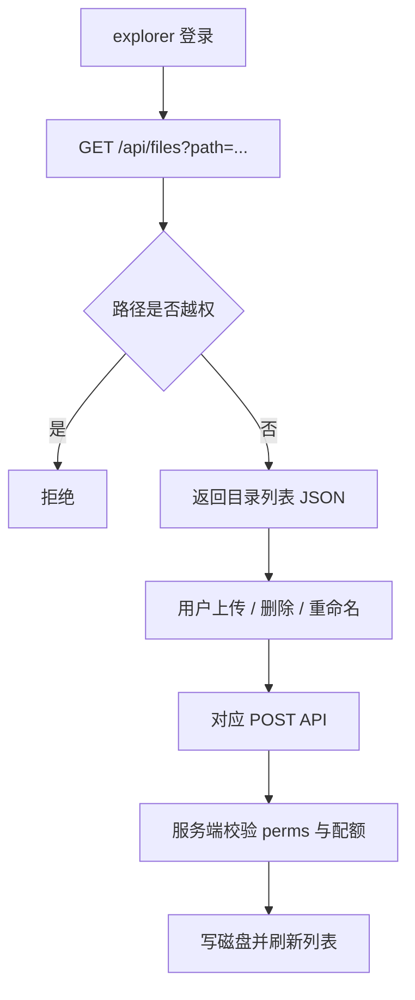

# 第4章 系统设计

本章在需求分析的基础上，对 **FTP 服务器辅助考试系统** 进行总体结构设计、数据库设计与核心业务流程设计，形成可实现、可测试的技术方案。论述风格与结构安排参考《理工外卖平台的设计与实现》第四章体例：**先给出系统功能分解与总体结构，再完成数据的概念与逻辑设计，最后通过流程图说明主要业务运转过程**。

---

## 4.1 系统总体功能结构图

通过对本系统建设目标与使用场景（机房文件收发、账号与配额管理、考试试卷池与随机分卷等）的归纳，将系统划分为 **Web 门户与认证**、**FTP 文件服务**、**管理控制台**、**用户文件浏览器**、**考试辅助子系统**、**数据持久化与日志** 六大功能域。各域之间通过 **HTTP/JSON API**、**FTP 协议** 与 **本地 MySQL 数据库** 协同：Web 与 FTP 共用用户与主目录信息，管理端可启停 FTP 并查看日志，考试子系统在写入用户表与文件目录的同时复用 FTP 作为考生交卷通道。

系统总体功能结构可用分解图（WBS 思路）概括。下图从顶层「FTP 服务器辅助考试系统」逐级展开至可交付子模块，对应实现中的主要源码与页面路径，便于与后续数据库表、接口设计对照。

**图4.1 系统总体功能结构图**

**说明：** 图中「考试辅助」与「管理控制台」在实现上共享管理员身份与部分 API；考生端以 **FTP 客户端** 或 **Web 文件浏览器** 访问个人 `home_dir` 下的文件，与图中「用户文件浏览器」分支对应。

---

## 4.2 数据库设计

数据库设计的目的是建立 **结构清晰、可扩展、便于审计** 的关系模式，支撑用户认证、FTP 配置与日志、考试与分卷等业务。本系统采用 **MySQL 8.x**，ORM 层使用 SQLAlchemy；部署时可通过 `Base.metadata.create_all` 与兼容脚本完成建表及历史字段修补。

### 4.2.1 数据库概念设计

本系统核心实体包括：**用户（User）**、**FTP 全局配置（FtpConfig）**、**FTP 操作日志（FtpLog）**、**考试（Exam）**、**试卷池条目（ExamPaper）**、**考生分卷记录（ExamStudent）**。其中 `ExamStudent` 与 `User` 通过 `user_id` 关联，与 `ExamPaper` 通过 `distributed_paper_id` 可选关联；`ExamPaper` 通过 `exam_id` 与 `Exam` 逻辑归属同一场考试。

各实体属性如下（与 ORM 模型一致）：

1. **用户实体**：主键 `id`，业务键 `username`，`password`（bcrypt 哈希），`role`（如 admin/user），`perms`（FTP 权限字），`home_dir`，`quota_bytes`，`used_bytes`，`enabled`，`last_login`，`created_at`。
2. **FTP 配置实体**：单例行（`id=1`），`max_download_speed`，`max_upload_speed`，`max_connections`，被动端口起止，`masquerade_address`。
3. **FTP 日志实体**：`username`，`action`，`filename`，`remote_ip`，`bytes_transferred`，`created_at`。
4. **考试实体**：`exam_id`（唯一），`exam_name`，`description`，`quota_bytes`（每考生配额），时间戳字段。
5. **试卷池实体**：`exam_id`，`filename`，`filepath`，`created_at`。
6. **考生分卷实体**：`user_id`，`exam_id`，`username`，`password_plain`（导出用），`seat_number`，分卷文件三字段及 `distributed_at`，`student_dir`，`created_at`。

**图4.2 系统核心 E-R 图（概念层）**

**说明：** `FtpLog`、`FtpConfig` 与 `User` 在概念上为「系统级」关联（日志记录用户名、配置全局生效），图中未强制画出到 `User` 的外键，与当前物理库设计一致。

### 4.2.2 数据库的逻辑结构设计

逻辑设计将概念模型映射为 **MySQL 表名、字段类型与主外键**。下列各表字段说明可直接用于建库说明与毕业设计「表4.x」正文；长度与类型与 `models.py` 及初始化脚本保持对齐（若 `init_mysql.sql` 与 ORM 存在差异，以运行时代码中 ORM 及 `db_helper` 兼容逻辑为准）。

**表4.1 用户信息表 users**

| 字段名 | 类型 | 空 | 默认值 | 说明 |
|--------|------|----|--------|------|
| id | INT | 否 | 自增 | 主键 |
| username | VARCHAR(50) | 否 | — | 登录名，唯一 |
| password | VARCHAR(255) | 否 | — | 密码 bcrypt 哈希 |
| role | VARCHAR(20) | 是 | user | admin / user 等 |
| perms | VARCHAR(50) | 是 | elr | FTP 权限字 |
| home_dir | VARCHAR(255) | 是 | '' | FTP/Web 根目录逻辑路径 |
| quota_bytes | BIGINT | 是 | 0 | 配额字节，0 表示不限 |
| used_bytes | BIGINT | 是 | 0 | 已使用字节 |
| enabled | BOOLEAN/TINYINT | 是 | 1 | 是否启用 |
| last_login | DATETIME | 是 | NULL | 最近登录时间 |
| created_at | DATETIME | 是 | CURRENT_TIMESTAMP | 创建时间 |

**表4.2 FTP 全局配置表 ftp_config**

| 字段名 | 类型 | 空 | 默认值 | 说明 |
|--------|------|----|--------|------|
| id | INT | 否 | 1 | 主键，固定单行 |
| max_download_speed | INT | 是 | 0 | 下载限速 KB/s，0 不限 |
| max_upload_speed | INT | 是 | 0 | 上传限速 KB/s，0 不限 |
| max_connections | INT | 是 | 100 | 最大连接数 |
| passive_ports_start | INT | 是 | 60000 | 被动端口起始 |
| passive_ports_end | INT | 是 | 60099 | 被动端口结束 |
| masquerade_address | VARCHAR(64) | 是 | '' | NAT 外网地址 |

**表4.3 FTP 操作日志表 ftp_logs**

| 字段名 | 类型 | 空 | 默认值 | 说明 |
|--------|------|----|--------|------|
| id | INT | 否 | 自增 | 主键 |
| username | VARCHAR(50) | 否 | — | 操作用户 |
| action | VARCHAR(50) | 否 | — | login/upload/download/delete 等 |
| filename | VARCHAR(255) | 是 | '' | 涉及文件名 |
| remote_ip | VARCHAR(64) | 是 | '' | 客户端 IP |
| bytes_transferred | BIGINT | 是 | 0 | 传输字节数 |
| created_at | DATETIME | 是 | CURRENT_TIMESTAMP | 记录时间 |

**表4.4 考试信息表 exams**

| 字段名 | 类型 | 空 | 默认值 | 说明 |
|--------|------|----|--------|------|
| id | INT | 否 | 自增 | 主键 |
| exam_id | VARCHAR(100) | 否 | — | 考试唯一标识，唯一索引 |
| exam_name | VARCHAR(255) | 是 | '' | 考试显示名称 |
| description | TEXT | 是 | '' | 考试说明 |
| quota_bytes | BIGINT | 是 | 0 | 每考生存储配额（字节） |
| created_at | DATETIME | 是 | — | 创建时间 |
| updated_at | DATETIME | 是 | — | 更新时间 |

**表4.5 试卷池表 exam_papers**

| 字段名 | 类型 | 空 | 默认值 | 说明 |
|--------|------|----|--------|------|
| id | INT | 否 | 自增 | 主键 |
| exam_id | VARCHAR(100) | 否 | — | 所属考试 ID，索引 |
| filename | VARCHAR(255) | 否 | — | 试卷文件名 |
| filepath | VARCHAR(500) | 否 | — | 服务器存储路径 |
| created_at | DATETIME | 是 | — | 入库时间 |

**表4.6 考生分卷表 exam_students**

| 字段名 | 类型 | 空 | 默认值 | 说明 |
|--------|------|----|--------|------|
| id | INT | 否 | 自增 | 主键 |
| user_id | INT | 否 | — | 外键 → users.id |
| exam_id | VARCHAR(100) | 否 | — | 考试 ID，索引 |
| username | VARCHAR(50) | 否 | — | 考生登录名 |
| password_plain | VARCHAR(100) | 是 | '' | 明文密码（导出用） |
| seat_number | VARCHAR(20) | 是 | '' | 工位号 |
| distributed_paper_id | INT | 是 | NULL | 外键 → exam_papers.id |
| distributed_paper_path | VARCHAR(500) | 是 | '' | 分卷相对路径 |
| distributed_paper_name | VARCHAR(255) | 是 | '' | 分卷文件名 |
| distributed_at | DATETIME | 是 | NULL | 分卷时间 |
| student_dir | VARCHAR(500) | 是 | '' | 考生独立目录 |
| created_at | DATETIME | 是 | — | 创建时间 |

---

## 4.3 系统流程设计

在平台化系统中，绘制 **总体流程** 与 **关键子流程** 有助于说明模块协作顺序与异常边界。本系统主路径为：**启动 main.py → 初始化目录与数据库 → 启动 FTP → 启动 Flask Web**；用户侧分为 **管理员流程** 与 **普通用户/考生流程**；考试场景在管理员完成 **建场、建账号、上传试卷池、随机分卷** 后，考生通过浏览器或 FTP 在个人目录中查看试卷并上传答卷。

**图4.3 系统总体业务流程图**

**图4.4 管理员登录与鉴权流程图**

**图4.5 考试辅助业务（创建—上传—分卷）流程图**

**图4.6 用户文件浏览与上传流程（简化）**

---

## 图表索引（撰写论文时可采用）

| 编号 | 名称 | 类型 |
|------|------|------|
| 图4.1 | 系统总体功能结构图 | 功能分解图（Mermaid） |
| 图4.2 | 系统核心 E-R 图 | 概念结构图（Mermaid） |
| 图4.3 | 系统总体业务流程图 | 流程图（Mermaid） |
| 图4.4 | 管理员登录与鉴权流程图 | 流程图（Mermaid） |
| 图4.5 | 考试辅助业务（创建—上传—分卷）流程图 | 流程图（Mermaid） |
| 图4.6 | 用户文件浏览与上传流程图 | 流程图（Mermaid） |
| 表4.1～表4.6 | 各逻辑表结构说明 | 数据表 |

**使用说明：**  
- 将本文复制到 Word 后，可用 [Mermaid Live Editor](https://mermaid.live) 或支持 Mermaid 的插件将各图导出为 **PNG/SVG**，再插入论文作为正式「图4.x」。  
- 表格可直接从 Markdown 粘贴到 Word，使用「文本转换成表格」或手动调整三线表格式以符合学校模板。

---

*本章依据项目当前 `models.py`、`main.py`、`web_server.py`、`web_server_exam.py`、`ftp_server.py` 及模板页面功能整理；若实现变更，请同步修订表字段与流程分支。*
